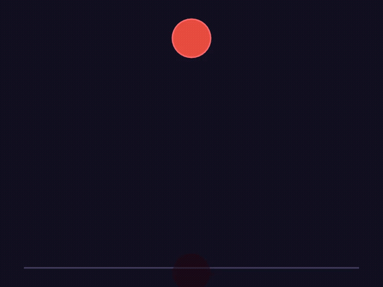

# Lumina

[](LICENSE)
[](#tests)
[](https://rustup.rs)

**Lumina** is a production-grade animation engine built in Rust. Write a JSON scene file, get a video out. No GUI, no scripting, no runtime dependencies beyond FFmpeg for MP4 export.

Designed from the start to be written by humans, LLMs, and code generators — the schema is declarative and fully validated.

---

## Demo

### The Unit Circle — 52 seconds of educational math animation from pure JSON

<video src="media/unit_circle.mp4" controls width="100%"></video>

Full scene source: [`examples/unit_circle.lsf`](examples/unit_circle.lsf)

Features shown: coordinate axes with grid, animated unit circle, rotating radius arm (Group rotation), sin(x) and cos(x) curves drawn simultaneously, camera zoom at the climax, LaTeX formula `sin²(x) + cos²(x) = 1` with proper Unicode superscripts, and 6 different easing functions across 30+ keyframes.

### Pythagorean Theorem — generated from 60 lines of JSON


### Bounce Easing — `ease_out_bounce` vs `ease_in_quad`



Rendered with:

```bash
./target/release/lumina-cli --scene examples/unit_circle.lsf --output media/unit_circle.mp4 --format mp4
./target/release/lumina-cli --scene examples/pythagorean.lsf --output media/pythagorean.mp4 --format mp4
./target/release/lumina-cli --scene examples/circle_bounce.lsf --output media/circle_bounce.mp4 --format mp4
```

No After Effects. No Python. No GUI. JSON in, video out.

---

## What It Is

Lumina is built around a single idea: animation state should be data, not code. The **Lumina Scene Format (LSF)** is a pure-JSON declarative description of a scene — objects, their initial properties, and a timeline of keyframes. The engine evaluates that timeline at any point in time, applies easing, and rasterizes the result to pixels.

This means:

- The entire scene is serializable, diffable, and versionable.
- An LLM can write a valid scene from a natural language prompt.
- Rendering is deterministic — same input, same output, byte for byte.
- Interactive and offline rendering share identical scene logic.

---

## Features

### Rendering

- **Dual backends** — CPU rasterizer (Tiny-Skia) for video export; GPU rasterizer (Vello/wgpu) for real-time and browser use. Both implement the same `Renderer` trait.
- **Camera system** — Zoom and pan the entire viewport as a first-class animated property. Camera state is interpolated from its own timeline with easing.
- **16 object types** — Circle, Rectangle, Polygon, Path, Line, Arrow, Text, LaTeX, Group, Image, SVG, NumberLine, Axes, Plot, BezierCurve.
- **Font rendering** — Load any TTF font from the scene's `assets.fonts` block. Glyphs are rasterized per-character via fontdue with correct baseline, descender, and superscript positioning.
- **Plot objects** — Evaluate arbitrary math functions (sin, cos, tan, sqrt, exp, ln, abs) over a connected Axes object's coordinate system. Hundreds of sample points rendered as a smooth polyline.
- **Axes objects** — Full coordinate system with configurable scale (pixels per unit), step size, tick marks, and optional dashed grid lines. Origin placed correctly even when x_range / y_range don't include zero.

### Animation

- **27 easing functions** — Linear, quad/cubic/quart/sine in/out/in-out variants, expo, circ, elastic, bounce, spring physics, `smooth` (Manim-compatible), `there_and_back`, CSS aliases.
- **Draw-on animation** — `draw_fraction: 0.0→1.0` on Line, BezierCurve, Plot, and Path objects. Lines use stroke-dash clipping. Bezier curves use de Casteljau subdivision for exact parametric clipping. Plots clip the x-domain so curves grow left-to-right at constant sample density.
- **LAB colorspace interpolation** — Color properties (hex strings) are interpolated in CIELAB rather than sRGB. Transitions through hue avoid the muddy midpoints that sRGB lerp produces. Implemented as a full RGB→XYZ D65→LAB→XYZ→sRGB pipeline.
- **Group transforms** — Nest objects into Groups with their own position, scale, and rotation. Children inherit the parent transform stack. Rotation is in degrees (user-facing) converted to radians internally.

### Text and Math

- **Real font rendering** — TTF fonts loaded from `assets.fonts` by ID. Each text object can reference a specific `font_id`, or falls back to any loaded font.
- **LaTeX Unicode substitution** — LaTeX expressions are preprocessed before rendering: `\theta`→θ, `\pi`→π, `\alpha`→α, `\sin`→sin, `^2`→², `^{n}`→ⁿ, full Greek alphabet, common operators (×, ±, ≤, ∞, →, ∫, Σ). The result renders as readable Unicode through the normal text pipeline.

### Architecture

- **Schema validation** — All LSF files are validated against a generated JSON Schema. Errors include structured `fix_suggestion` fields ready to re-inject into an LLM correction loop.
- **Event bus** — Scenes can define interactive events (mouse click, hover) that trigger timeline jumps or property overrides at runtime.
- **WASM runtime** — The full engine compiles to WebAssembly. `render_frame(time)` returns raw RGBA pixels; `hit_test(x, y, time)` returns the top object at a point.
- **Headless server** — Axum HTTP server with `/render`, `/validate`, `/patch`, `/schema` endpoints.

---

## Getting Started

### Prerequisites

- **Rust** — latest stable via [rustup](https://rustup.rs)
- **FFmpeg** — for MP4/WebM export (`apt install ffmpeg` / `brew install ffmpeg`)
- A TTF font for text rendering (e.g. LiberationSans from `fonts-liberation` on Ubuntu)

### Build

```bash
git clone https://github.com/SakarZaidan/lumina.git
cd lumina
cargo build --release
```

### Render a Scene

```bash
# PNG frame sequence
./target/release/lumina-cli --scene examples/hello.lsf --output frames/ --format png

# MP4 video
./target/release/lumina-cli --scene examples/unit_circle.lsf --output unit_circle.mp4 --format mp4
```

---

## Scene Format (LSF)

### Minimal example — text fade-in

```json
{
  "version": "1.0",
  "meta": { "title": "Fade In", "author": "you", "created_at": "2026-05-09" },
  "canvas": {
    "width": 1280, "height": 720, "fps": 60,
    "duration": 2.0, "background": "#0F0F1A"
  },
  "assets": {
    "fonts": [
      { "id": "sans", "path": "/usr/share/fonts/truetype/liberation/LiberationSans-Regular.ttf" }
    ]
  },
  "objects": {
    "title": {
      "type": "Text",
      "properties": {
        "content": "Hello, Lumina",
        "x": 480, "y": 360,
        "font_id": "sans",
        "font_size": 96,
        "color": "#FFFFFF",
        "opacity": 0.0
      }
    }
  },
  "timeline": [
    { "time": 0.0, "object": "title", "state": { "opacity": 0.0 }, "easing": "linear" },
    { "time": 1.5, "object": "title", "state": { "opacity": 1.0 }, "easing": "ease_out_cubic" }
  ],
  "events": []
}
```

### Draw-on animation

Animate any line, curve, or plot growing onto screen:

```json
"objects": {
  "curve": {
    "type": "Plot",
    "properties": {
      "function_str": "sin(x)",
      "axes_id": "axes",
      "color": "#F78166",
      "stroke_width": 3,
      "sample_count": 300,
      "draw_fraction": 0.0,
      "opacity": 1.0, "z_index": 2
    }
  }
},
"timeline": [
  { "time": 1.0, "object": "curve", "state": { "draw_fraction": 0.0 }, "easing": "linear" },
  { "time": 5.0, "object": "curve", "state": { "draw_fraction": 1.0 }, "easing": "ease_out_expo" }
]
```

The curve grows left-to-right over 4 seconds. Works the same way on `Line` and `BezierCurve`.

### Camera zoom

```json
"camera": {
  "timeline": [
    { "time": 0.0,  "state": { "x": 0, "y": 0, "zoom": 1.0 }, "easing": "linear" },
    { "time": 10.0, "state": { "x": -80, "y": 30, "zoom": 1.4 }, "easing": "ease_in_out_cubic" },
    { "time": 13.0, "state": { "x": 0, "y": 0, "zoom": 1.0 }, "easing": "ease_in_out_cubic" }
  ]
}
```

Camera `x`/`y` are screen-pixel pan offsets. Zoom is applied around the canvas center.

### Function plots with Axes

```json
"axes": {
  "type": "Axes",
  "properties": {
    "x_range": [0, 6.5], "y_range": [-1.5, 1.5],
    "x": 200, "y": 500,
    "scale": 80,
    "x_step": 1, "y_step": 0.5,
    "grid": true,
    "color": "#3D5A80",
    "z_index": 1, "opacity": 1.0
  }
},
"sin_plot": {
  "type": "Plot",
  "properties": {
    "function_str": "sin(x)",
    "axes_id": "axes",
    "color": "#F78166",
    "stroke_width": 3,
    "sample_count": 300,
    "z_index": 2, "opacity": 1.0
  }
}
```

Supported functions: `sin`, `cos`, `tan`, `sqrt`, `abs`, `exp`, `ln`. Write bare names — the engine normalizes to the evalexpr `math::` namespace internally.

---

## Easing Functions (27)

```
linear

ease_in_quad        ease_out_quad        ease_in_out_quad
ease_in_cubic       ease_out_cubic       ease_in_out_cubic
ease_in_quart       ease_out_quart       ease_in_out_quart
ease_in_sine        ease_out_sine        ease_in_out_sine
ease_in_expo        ease_out_expo
ease_in_circ        ease_out_circ
ease_in_elastic     ease_out_elastic     ease_in_out_elastic
ease_in_bounce      ease_out_bounce

spring              smooth               there_and_back
rush_into           rush_from

ease  ease_in  ease_out  ease_in_out     (CSS aliases)
```

All satisfy `f(0.0) == 0.0` and `f(1.0) == 1.0`, verified by the test suite.

---

## Tests

**44 tests, 0 failures.**

```
lumina-core       29 tests   easing (11), timeline (8), interpolation (5), stress (3, up to 2000 objects)
lumina-renderer   11 tests   pixel-level: z-index ordering, opacity, draw_fraction, background, determinism
lumina-export      4 tests   PNG sequence, dimensions, brightness, FFmpeg graceful failure
```

```bash
cargo test --workspace --exclude lumina-wasm
```

Selected output:

```
test easing_tests::tests::test_all_easings_boundary_conditions ... ok
test easing_tests::tests::test_elastic_out_overshoots_then_settles ... ok
test easing_tests::tests::test_there_and_back_midpoint_is_one ... ok
test easing_tests::tests::test_spring_starts_at_zero_ends_near_one ... ok
test interp_tests::interp_tests::test_color_lab_interpolation_midpoint ... ok
test interp_tests::interp_tests::test_color_interpolation_at_t0_returns_start ... ok
test timeline_tests::tests::test_linear_interpolation_at_midpoint ... ok
test timeline_tests::tests::test_ease_in_quad_is_nonlinear_at_midpoint ... ok
test renderer_tests::tests::test_z_index_determines_draw_order ... ok
test renderer_tests::tests::test_draw_fraction_zero_hides_line ... ok
test renderer_tests::tests::test_draw_fraction_one_draws_full_line ... ok
test renderer_tests::tests::test_circle_center_pixel_matches_fill ... ok
test stress_tests::tests::test_rendering_volume_2000_objects ... ok

test result: ok. 44 passed; 0 failed
```

---

## Architecture

```
lumina/
├── crates/
│   ├── lumina-schema/     LSF type definitions, JSON Schema generation (schemars)
│   ├── lumina-core/       Scene graph, timeline evaluator, 27 easings, LAB interpolation, event bus
│   ├── lumina-renderer/   Renderer trait → SkiaRenderer (CPU) + VelloRenderer (GPU)
│   ├── lumina-text/       Fontdue TTF rasterization, glyph layout
│   ├── lumina-export/     PNG sequence export, MP4 via FFmpeg stdin pipe
│   ├── lumina-server/     Axum HTTP server: /render /validate /patch /schema
│   └── lumina-wasm/       wasm-bindgen runtime: render_frame, hit_test, process_event
├── tools/
│   └── lumina-cli/        CLI entry point
├── examples/              hello.lsf  pythagorean.lsf  circle_bounce.lsf  unit_circle.lsf
└── media/                 *.mp4  *.gif
```

### Data flow

```
LSF JSON
   │
   ▼
Schema Validator ──── structured errors with fix_suggestion
   │
   ▼
Scene Graph + Timeline ──── keyframe evaluation, easing, LAB color interp
   │
   ├── [Offline]  → SkiaRenderer (CPU/Tiny-Skia) → FFmpeg → MP4 / PNG sequence
   ├── [GPU]      → VelloRenderer (wgpu, software fallback) → raw RGBA
   └── [Browser]  → WASM + SkiaRenderer → putImageData → 60 fps canvas
```

### Renderer backends

| Backend | Crate | Status | Use case |
|---|---|---|---|
| SkiaRenderer | tiny-skia | Production | Video export, CI/CD, headless server |
| VelloRenderer | vello 0.2 + wgpu | Complete | GPU acceleration, browser canvas |

The `Renderer` trait is backend-agnostic. Adding a new backend means implementing two methods: `render_frame` and `load_font`.

---

## Example Scenes

| Scene | Duration | Objects | Demonstrates |
|---|---|---|---|
| [`examples/hello.lsf`](examples/hello.lsf) | 3s | Text, Line | Fade-in, `ease_out_sine` |
| [`examples/pythagorean.lsf`](examples/pythagorean.lsf) | 8s | Polygon, Arrow, LaTeX, Group | Spring scale, label timing |
| [`examples/circle_bounce.lsf`](examples/circle_bounce.lsf) | 4s | Circle, Line | `ease_out_bounce` vs `ease_in_quad` |
| [`examples/unit_circle.lsf`](examples/unit_circle.lsf) | 52s | Circle, Axes, Plot, Group, Text, LaTeX | Full math video: font, camera, draw_fraction, LAB color |

---

## AI Integration

Lumina's LSF is designed to be written by LLMs — no imperative logic, just data:

```python
import anthropic

client = anthropic.Anthropic()

response = client.messages.create(
    model="claude-sonnet-4-6",
    max_tokens=4096,
    system="""You generate Lumina Scene Format (LSF) JSON.
Rules:
- Objects go in "objects" block with "type" and "properties"
- Timeline entries have: time (float), object (string id), state (object), easing (string)
- Supported easings: linear, ease_out_cubic, ease_out_elastic, ease_out_bounce, smooth, spring
- Supported types: Circle, Rectangle, Line, Arrow, Text, LaTeX, Group, Axes, Plot, BezierCurve
Return ONLY valid JSON.""",
    messages=[{
        "role": "user",
        "content": "Animate a sine wave drawing itself onto the screen over 3 seconds."
    }]
)

scene_json = response.content[0].text
```

Validation errors are structured for LLM re-injection:

```json
{
  "valid": false,
  "errors": [
    {
      "code": "UNKNOWN_OBJECT_ID",
      "path": "$.timeline[2].object",
      "message": "Timeline references 'circle_2' but no such object exists.",
      "fix_suggestion": "Add 'circle_2' to the objects block, or change the reference to 'circle_1'."
    }
  ]
}
```

---

## Headless Server

```bash
cargo run -p lumina-server

# Validate
curl -X POST http://localhost:3000/validate \
  -H "Content-Type: application/json" \
  -d @examples/unit_circle.lsf

# Render to MP4
curl -X POST http://localhost:3000/render \
  -H "Content-Type: application/json" \
  -d '{"scene": {...}, "format": "mp4"}' \
  --output animation.mp4
```

---

## Roadmap

| Phase | Status | Scope |
|---|---|---|
| Phase 1 — Core Engine | **Complete** | LSF schema, Skia renderer, timeline, 27 easings, export, CLI, server |
| Phase 2 — Rendering Quality | **Complete** | Vello GPU backend, camera system, Plot rendering, LAB color interp, draw-on animation, font rendering |
| Phase 3 — WASM & Web | In Progress | WebGPU surface, interactive events, React SDK |
| Phase 4 — AI Cloud API | Planned | Hosted render endpoint, AI self-correction SDK, Python bindings |
| Phase 5 — Studio | Planned | Browser timeline editor, team collaboration, Tauri desktop app |

---

## Contributing

All PRs require `cargo test --workspace --exclude lumina-wasm` to pass. See [CONTRIBUTING.md](CONTRIBUTING.md).

## Authors

**sakar hashim** — Lead Developer

## License

MIT — see [LICENSE](LICENSE).
