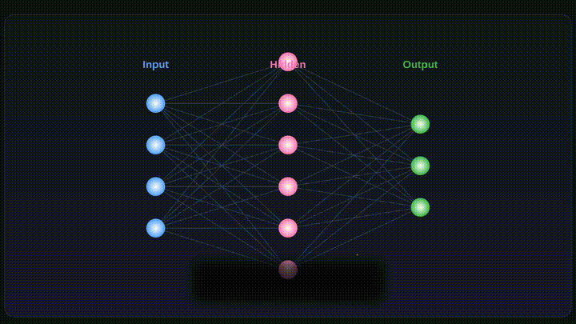

# Lumina

[](LICENSE)
[](https://github.com/SakarZaidan/lumina/actions/workflows/ci.yml)
[](https://rustup.rs)
[](https://sakarzaidan.github.io/lumina/)

**Lumina** is a production-grade animation engine built in Rust. Write a JSON scene file, get a video out. No GUI, no scripting, no runtime dependencies beyond FFmpeg for MP4 export.

Designed from the start to be written by humans, LLMs, and code generators — the schema is declarative, fully validated, and machine-friendly.

> **Why Lumina, and what never changes:** [VISION.md](VISION.md) · **Why it's built this way:** [DESIGN.md](DESIGN.md) · **How we engineer:** [ENGINEERING_PRINCIPLES.md](ENGINEERING_PRINCIPLES.md) · **How to contribute:** [CONTRIBUTING.md](CONTRIBUTING.md) · **Who decides:** [GOVERNANCE.md](GOVERNANCE.md)

---

## Showcase

### Neural Network Backpropagation — 2.5 min educational animation from pure JSON



▶ **Full 2.5-minute video:** [`media/showcase_neural_network.mp4`](media/showcase_neural_network.mp4) (1280×720, 4500 frames)

Render command:
```bash
python3 examples/gen_neural_showcase.py          # generates examples/showcase_neural_network.lsf
lumina-cli --scene examples/showcase_neural_network.lsf --output media/showcase_neural_network.mp4 --format mp4
```

Features demonstrated: SVG icon compositing, radial-gradient neurons, gradient + drop-shadow panels, animated loss curve, LaTeX forward-pass / gradient equations with draw-on, particle activation bursts, camera choreography across acts, letter-spacing title text, backpropagation arrows with `draw_fraction`.

### The Unit Circle — 52 seconds of educational math animation

<video src="media/unit_circle.mp4" controls width="100%"></video>

Full scene source: [`examples/unit_circle.lsf`](examples/unit_circle.lsf)

### More examples

| | |
|---|---|
|  |  |
| Fourier harmonic convergence | Animated bar chart |

Rendered with:
```bash
lumina-cli --scene examples/<name>.lsf --output media/<name>.mp4 --format mp4
```

No After Effects. No Python. No GUI. JSON in, video out.

---

## What It Is

Lumina is built around a single idea: animation state should be data, not code. The **Lumina Scene Format (LSF)** is a pure-JSON declarative description of a scene — objects, their initial properties, and a timeline of keyframes. The engine evaluates that timeline at any point in time, applies easing, and rasterizes the result to pixels.

This means:

- The entire scene is serializable, diffable, and versionable.
- An LLM can write a valid scene from a natural language prompt.
- Rendering is deterministic — same input, same output, byte for byte.
- Interactive and offline rendering share identical scene logic.

---

## Features

### Rendering

- **Dual backends at parity** — CPU rasterizer (Tiny-Skia) and GPU rasterizer (Vello/wgpu), both implementing the same `Renderer` trait. As of v0.3.0 the Vello backend renders **text, LaTeX, MathML, images, SVG and particles** in addition to geometry (gradients and drop shadows remain Skia-only).
- **Camera system** — Zoom and pan the entire viewport as a first-class animated property. Camera state is interpolated from its own timeline with easing.
- **17 object types** — Circle, Rectangle, Polygon, Path, Line, Arrow, Text, LaTeX, Group, Image, SVG, NumberLine, Axes, Plot, BezierCurve, MathML, Particles.
- **Font rendering** — Load any TTF font from the scene's `assets.fonts` block. Glyphs are rasterized per-character via fontdue with correct baseline, descender, and superscript positioning.
- **Plot objects** — Evaluate arbitrary math functions (sin, cos, tan, sqrt, exp, ln, abs) over a connected Axes object's coordinate system. Hundreds of sample points rendered as a smooth polyline.
- **Axes objects** — Full coordinate system with configurable scale (pixels per unit), step size, tick marks, and optional dashed grid lines. Origin placed correctly even when x_range / y_range don't include zero.

### Visual Effects

- **Gradients** — Linear and radial gradient fills on closed shapes (Circle, Rectangle, Polygon, Path). Declared inline in the `fill` or `stroke` field as a gradient object alongside plain hex colors.
- **Drop shadows / glow** — Optional `shadow` property on all closed shapes. Shadow is rendered as a tinted, box-blurred silhouette offset before the shape, at zero cost for shapes that omit it.
- **Rounded rectangles** — `rx`/`ry` properties on `RectangleProps` build rounded corners via quadratic Bézier path. `rx == 0` keeps the existing fast-path unchanged.
- **Text alignment** — `align: "left" | "center" | "right"` on `Text` and `LaTeX` objects. The engine measures glyph widths and offsets the start position accordingly.
- **Letter spacing** — `letter_spacing: f32` adds per-glyph cursor offset for display typography.

```json
"panel": {
  "type": "Rectangle",
  "properties": {
    "x": 100, "y": 80, "width": 480, "height": 260,
    "rx": 20, "ry": 20,
    "fill": { "type": "linear", "stops": [[0.0, "#1A1A2E"], [1.0, "#16213E"]], "angle": 135 },
    "shadow": { "color": "#000000", "blur": 18, "dx": 0, "dy": 6, "opacity": 0.7 },
    "opacity": 1.0, "z_index": 1
  }
}
```

### Image & Media Compositing

Load PNG, JPEG, animated GIF, or SVG files into a scene and composite them as first-class objects. The renderer decodes assets once on load and composites them each frame with correct premultiplied alpha blending.

- **Static images** — PNG/JPEG loaded via the `image` crate; composited at the target rect with opacity and rotation.
- **SVG** — Parsed with `usvg`, rasterized on demand with `resvg`, and cached by `(asset_id, width, height)`.
- **Animated GIF** — Decoded with `image::codecs::gif::GifDecoder`; frame selected by `(current_time % total_duration)` so GIFs loop in sync with the animation timeline.

```json
"assets": {
  "images": [
    { "id": "logo", "path": "examples/assets/lumina_node.svg" },
    { "id": "data_gif", "path": "examples/assets/activation.gif" }
  ]
},
"objects": {
  "icon": {
    "type": "SVG",
    "properties": { "asset_id": "logo", "x": 860, "y": 40, "width": 80, "height": 80, "opacity": 1.0 }
  },
  "anim": {
    "type": "Image",
    "properties": { "asset_id": "data_gif", "x": 200, "y": 300, "width": 120, "height": 120, "opacity": 0.9 }
  }
}
```

### Animation

- **28 easing functions + `cubic_bezier` + `spline`** — Linear, quad/cubic/quart/sine in/out/in-out variants, expo, circ, elastic, bounce, spring physics, `smooth` (Manim-compatible), `there_and_back`, CSS aliases. `cubic_bezier(x1,y1,x2,y2)` implements the full CSS spec via a binary-search parametric solver; `spline` does overshoot-free monotone-cubic interpolation through `easing_params.keypoints`.
- **Draw-on animation** — `draw_fraction: 0.0→1.0` on Line, BezierCurve, Plot, Path, and LaTeX objects.
- **Path morphing** — Animate one polygon/path into another of a different vertex count.
- **LAB colorspace interpolation** — Color transitions through hue avoid muddy sRGB midpoints.
- **Group transforms** — Nest objects into Groups with their own position, scale, and rotation.

### Text and Math

- **Real font rendering** — TTF fonts loaded from `assets.fonts` by ID. Per-character font fallback.
- **LaTeX Unicode substitution** — full Greek alphabet, common operators, `\frac{a}{b}`→`a/b`, super/subscripts (`x^2`→x², `a_n`→aₙ, `e^x`→eˣ), `\sqrt`, `\sum`, `\int`, spacing commands. Renders on both backends.
- **MathML** — `MathML` object type renders markup via a unicode fallback path; hit-testable bbox.

### Architecture

- **Schema validation** — Errors include structured `fix_suggestion` fields for LLM correction loops.
- **Event bus** — Interactive events (click, double-click, hover, drag) drive `jump_to_time`, `play_from`, `pause`, `set_property`, `tween_to`, `show_tooltip` and `emit_custom` actions. `$drag.*` payload placeholders are substituted at dispatch; `process_event` returns playback state + emitted custom events.
- **Semantic scene patching** — `lumina_core::scene_patch` applies domain-level ops (`add_object`, `add_keyframe`, `update_property`, `update_canvas`, …) with cascade deletes; exposed at `POST /scene_patch`.
- **WASM runtime** — Full engine in WebAssembly. `render_frame(time)` → raw RGBA; `hit_test(x, y, time)` → top object ID across all 17 types.
- **Headless server** — Axum HTTP: `/render` (mp4/webm/gif), `/validate`, `/patch` (RFC 6902), `/scene_patch` (semantic), `/schema`, `/objects`.
- **Live reload** — `lumina-cli --watch` re-renders a preview frame on every file change.
- **Particles** — Deterministic seeded particle simulation evaluated at the current time — reproducible across renders and interactive scrubbing.

---

## Getting Started

### Prerequisites

- **Rust** — latest stable via [rustup](https://rustup.rs)
- **FFmpeg** — for MP4 / WebM / GIF export (`apt install ffmpeg` / `brew install ffmpeg`)
- A TTF font for text rendering (e.g. LiberationSans from `fonts-liberation` on Ubuntu)

### Build

```bash
git clone https://github.com/SakarZaidan/lumina.git
cd lumina
cargo build --release
```

### Render a Scene

```bash
# PNG frame sequence
./target/release/lumina-cli --scene examples/hello.lsf --output frames/ --format png

# MP4 video
./target/release/lumina-cli --scene examples/unit_circle.lsf --output unit_circle.mp4 --format mp4

# WebM (VP9) and animated GIF
./target/release/lumina-cli --scene examples/unit_circle.lsf --output unit_circle.webm --format webm
./target/release/lumina-cli --scene examples/unit_circle.lsf --output unit_circle.gif  --format gif

# GPU (Vello) backend — renders text, LaTeX, images and particles too
./target/release/lumina-cli --scene examples/showcase_grand.lsf --output grand.mp4 --format mp4 --backend vello
```

---

## Scene Format (LSF)

### Minimal example — text fade-in

```json
{
  "version": "1.0",
  "meta": { "title": "Fade In", "author": "you", "created_at": "2026-05-09" },
  "canvas": {
    "width": 1280, "height": 720, "fps": 60,
    "duration": 2.0, "background": "#0F0F1A"
  },
  "assets": {
    "fonts": [
      { "id": "sans", "path": "examples/assets/fonts/LiberationSans-Regular.ttf" }
    ]
  },
  "objects": {
    "title": {
      "type": "Text",
      "properties": {
        "content": "Hello, Lumina",
        "x": 480, "y": 360,
        "font_id": "sans",
        "font_size": 96,
        "color": "#FFFFFF",
        "opacity": 0.0,
        "align": "center"
      }
    }
  },
  "timeline": [
    { "time": 0.0, "object": "title", "state": { "opacity": 0.0 }, "easing": "linear" },
    { "time": 1.5, "object": "title", "state": { "opacity": 1.0 }, "easing": "ease_out_cubic" }
  ],
  "events": []
}
```

### Draw-on animation

Animate any line, curve, or plot growing onto screen:

```json
"timeline": [
  { "time": 1.0, "object": "curve", "state": { "draw_fraction": 0.0 }, "easing": "linear" },
  { "time": 5.0, "object": "curve", "state": { "draw_fraction": 1.0 }, "easing": "ease_out_expo" }
]
```

### Gradient + shadow panel

```json
"panel": {
  "type": "Rectangle",
  "properties": {
    "x": 100, "y": 80, "width": 480, "height": 260,
    "rx": 20, "ry": 20,
    "fill": {
      "type": "linear",
      "stops": [[0.0, "#1A1A2E"], [1.0, "#16213E"]],
      "angle": 135
    },
    "shadow": { "color": "#000000", "blur": 18, "dx": 0, "dy": 6, "opacity": 0.7 },
    "opacity": 1.0, "z_index": 1
  }
}
```

### Camera zoom

```json
"camera": {
  "timeline": [
    { "time": 0.0,  "state": { "x": 0, "y": 0, "zoom": 1.0 }, "easing": "linear" },
    { "time": 10.0, "state": { "x": -80, "y": 30, "zoom": 1.4 }, "easing": "ease_in_out_cubic" },
    { "time": 13.0, "state": { "x": 0, "y": 0, "zoom": 1.0 }, "easing": "ease_in_out_cubic" }
  ]
}
```

### Function plots with Axes

```json
"sin_plot": {
  "type": "Plot",
  "properties": {
    "function_str": "sin(x)",
    "axes_id": "axes",
    "color": "#F78166",
    "stroke_width": 3,
    "sample_count": 300,
    "z_index": 2, "opacity": 1.0
  }
}
```

Supported functions: `sin`, `cos`, `tan`, `sqrt`, `abs`, `exp`, `ln`.

### Particles

```json
"sparks": {
  "type": "Particles",
  "properties": {
    "emitter_x": 960, "emitter_y": 540,
    "count": 80,
    "lifetime": 1.2,
    "speed": 180,
    "spread": 360,
    "color": "#FFDD57",
    "opacity": 1.0, "z_index": 10
  }
}
```

Particle state is computed analytically from the current time — no simulation state, fully deterministic, scrub-safe.

---

## Easing Functions (27)

```
linear

ease_in_quad        ease_out_quad        ease_in_out_quad
ease_in_cubic       ease_out_cubic       ease_in_out_cubic
ease_in_quart       ease_out_quart       ease_in_out_quart
ease_in_sine        ease_out_sine        ease_in_out_sine
ease_in_expo        ease_out_expo
ease_in_circ        ease_out_circ
ease_in_elastic     ease_out_elastic     ease_in_out_elastic
ease_in_bounce      ease_out_bounce

spring              smooth               there_and_back
rush_into           rush_from

ease  ease_in  ease_out  ease_in_out     (CSS aliases)

cubic_bezier                             (parameterised, any [x1,y1,x2,y2] control points)
```

Use `cubic_bezier` with `easing_params` to match any CSS `cubic-bezier()` curve exactly:

```json
{ "time": 2.0, "object": "box", "state": { "x": 800 }, "easing": "cubic_bezier",
  "easing_params": [0.34, 1.56, 0.64, 1.0] }
```

---

## Tests

**92 tests, 0 failures.**

```
lumina-core       51 tests   easing (incl. spline), timeline, interpolation (path morph + cubic_bezier),
                              events (jump/play/pause/emit + $drag), scene_patch (add/remove/update), stress
lumina-renderer   25 tests   pixel-level: z-index, opacity, draw_fraction, determinism, image/SVG/GIF,
                              gradient, rounded rect, shadow, particles, Vello parity (particles + image),
                              LaTeX→Unicode (superscripts, \frac, subscripts, command stripping)
lumina-export      6 tests   PNG sequence, dimensions, brightness, MP4/WebM/GIF export, FFmpeg graceful failure
lumina-server     10 tests   validation, schema, JSON Patch, semantic scene_patch, group cycle, object registry
```

```bash
cargo test --workspace --exclude lumina-wasm
```

---

## Architecture

```
lumina/
├── crates/
│   ├── lumina-schema/     LSF type definitions, JSON Schema generation (schemars)
│   ├── lumina-core/       Scene graph, timeline, 28 easings (+ cubic_bezier/spline), LAB interp, event bus, scene_patch
│   ├── lumina-renderer/   Renderer trait → SkiaRenderer (CPU) + VelloRenderer (GPU/wgpu); shared raster module
│   ├── lumina-text/       Fontdue TTF rasterization, glyph layout, per-character font fallback
│   ├── lumina-export/     PNG sequence + MP4 / WebM / GIF via FFmpeg stdin pipe
│   ├── lumina-server/     Axum HTTP: /render /validate /patch /scene_patch /schema /objects
│   ├── lumina-wasm/       wasm-bindgen: render_frame, hit_test (17 types), process_event
│   └── lumina-bench/      Criterion benchmarks: timeline eval, Skia render, easing dispatch
├── sdks/
│   ├── javascript/        React (LuminaPlayer, useLumina) + vanilla-JS (createPlayer), dual ESM/CJS
│   └── python/            PyO3 + maturin: lumina.validate / lumina.render / lumina.schema
├── tools/
│   └── lumina-cli/        CLI: --watch live-reload, --backend skia|vello, --format png|mp4|webm|gif
├── examples/              9 showcase LSF scenes + generator scripts
└── media/                 *.mp4  *.gif
```

### Data flow

```
LSF JSON
   │
   ▼
Schema Validator ──── structured errors with fix_suggestion
   │
   ▼
Scene Graph + Timeline ──── keyframe evaluation, easing, LAB color interp
   │
   ├── [Offline]  → SkiaRenderer (CPU/Tiny-Skia) → FFmpeg → MP4 / WebM / GIF / PNG sequence
   ├── [GPU]      → VelloRenderer (wgpu, software fallback) → raw RGBA (text/image/particle parity)
   └── [Browser]  → WASM + SkiaRenderer → putImageData → 60 fps canvas
```

### Renderer backends

| Backend | Crate | Status | Use case |
|---|---|---|---|
| SkiaRenderer | tiny-skia | Production | Video export, CI/CD, headless server; full feature set incl. gradients + shadows |
| VelloRenderer | vello 0.2 + wgpu | Production | GPU acceleration; geometry, text, LaTeX, images, SVG, particles (gradients/shadows pending) |

The `Renderer` trait is backend-agnostic: `render_frame`, `load_font`, `load_image`, and `set_time`.

---

## Example Scenes

| Scene | Duration | Objects | Demonstrates |
|---|---|---|---|
| [`examples/hello.lsf`](examples/hello.lsf) | 3s | Text, Line | Fade-in, `ease_out_sine` |
| [`examples/pythagorean.lsf`](examples/pythagorean.lsf) | 8s | Polygon, Arrow, LaTeX, Group | Spring scale, label timing |
| [`examples/circle_bounce.lsf`](examples/circle_bounce.lsf) | 4s | Circle, Line | `ease_out_bounce` vs `ease_in_quad` |
| [`examples/unit_circle.lsf`](examples/unit_circle.lsf) | 52s | Circle, Axes, Plot, Group, Text, LaTeX | Full math video: camera, draw_fraction, LAB color |
| [`examples/fourier_series.lsf`](examples/fourier_series.lsf) | 12s | Axes, Plot (×4), Text, LaTeX | Harmonic convergence, overlapping draw_fraction curves |
| [`examples/dataviz_bars.lsf`](examples/dataviz_bars.lsf) | 6s | Rectangle (×4), Line, Text | Animated bar chart, `ease_out_bounce`, value labels |
| [`examples/neural_net.lsf`](examples/neural_net.lsf) | 11s | Circle (×9), Line (×20), Group (×3) | Group scale-in, draw_fraction connections, activation pulse |
| [`examples/showcase_neural_network.lsf`](examples/showcase_neural_network.lsf) | 150s | 79 objects | **Flagship**: SVG icons, gradients, shadows, particles, loss curve, LaTeX backprop, camera choreography |
| [`examples/showcase_grand.lsf`](examples/showcase_grand.lsf) | 45s | 20 objects | **v0.3.0 reel** (rendered on the **Vello GPU** backend): spline easing, GPU text/LaTeX/SVG/particles, camera, interactive event annotations |

---

## AI Integration

Lumina's LSF is designed to be written by LLMs — no imperative logic, just data:

```python
import anthropic

client = anthropic.Anthropic()

response = client.messages.create(
    model="claude-sonnet-4-6",
    max_tokens=4096,
    system="""You generate Lumina Scene Format (LSF) JSON.
Rules:
- Objects go in "objects" block with "type" and "properties"
- Timeline entries have: time (float), object (string id), state (object), easing (string)
- Supported easings: linear, ease_out_cubic, ease_out_elastic, ease_out_bounce, smooth, spring
- Supported types: Circle, Rectangle, Line, Arrow, Text, LaTeX, Group, Axes, Plot, BezierCurve,
                   Image, SVG, Particles, MathML
- Rectangle supports: rx/ry (rounded corners), fill (hex or gradient), shadow (object)
Return ONLY valid JSON.""",
    messages=[{
        "role": "user",
        "content": "Animate a sine wave drawing itself onto the screen over 3 seconds."
    }]
)

scene_json = response.content[0].text
```

Validation errors are structured for LLM re-injection:

```json
{
  "valid": false,
  "errors": [
    {
      "code": "UNKNOWN_OBJECT_ID",
      "path": "$.timeline[2].object",
      "message": "Timeline references 'circle_2' but no such object exists.",
      "fix_suggestion": "Add 'circle_2' to the objects block, or change the reference to 'circle_1'."
    }
  ]
}
```

---

## JavaScript SDK

```bash
npm install @lumina/sdk
```

### React

```tsx
import { LuminaPlayer } from '@lumina/sdk';

<LuminaPlayer
  scene={myScene}
  autoplay
  loop
  displayWidth={960}
  displayHeight={540}
  onObjectClick={(id) => console.log('clicked:', id)}
/>
```

### Vanilla JS

```js
import { createPlayer } from '@lumina/sdk';

const player = await createPlayer(document.getElementById('canvas'), scene, { autoplay: true });
player.seek(3.5);
```

---

## Python SDK

```bash
cd sdks/python && maturin develop
```

```python
import lumina

# Validate a scene dict
result = lumina.validate(scene_dict)
print(result["valid"], result.get("errors"))

# Render to file (drives SkiaRenderer + FFmpeg in-process, no shell-out)
lumina.render(scene_dict, "output.mp4", format="mp4")

# Get the live JSON Schema
schema = lumina.schema()
```

See [`sdks/python/examples/from_anthropic.py`](sdks/python/examples/from_anthropic.py) for a complete LLM → validate → render loop.

---

## Headless Server

```bash
cargo run -p lumina-server

# Validate
curl -X POST http://localhost:3000/validate \
  -H "Content-Type: application/json" \
  -d @examples/unit_circle.lsf

# Render to MP4
curl -X POST http://localhost:3000/render \
  -H "Content-Type: application/json" \
  -d '{"scene": {...}, "format": "mp4"}' \
  --output animation.mp4

# Inspect available object types
curl http://localhost:3000/objects | jq '.Circle'

# Live JSON Schema
curl http://localhost:3000/schema
```

---

## Roadmap

| Phase | Status | Scope |
|---|---|---|
| Phase 1 — Core Engine | **Complete** | LSF schema, Skia renderer, timeline, easing library, export, CLI, server |
| Phase 2 — Rendering Quality | **Complete** | Vello GPU backend, camera system, Plot/Axes, LAB color, draw-on animation, font rendering |
| Phase 3 — WASM & Web | **Complete** | Full WASM hit-test (17 types), React SDK, vanilla-JS SDK, `useLumina` hook |
| Phase 4 — Advanced Animation | **Complete** | cubic_bezier easing, path morphing, LaTeX draw_fraction, font fallback, file watcher, benches |
| Phase 5 — Showcase & Polish | **Complete** | 3 new example scenes, JSON Patch server, schema endpoint, cargo-deny, CI |
| Phase 6 — Visual Effects & Media | **Complete** | Image/SVG/GIF compositing, gradients, drop shadows, rounded corners, text alignment, MathML, Particles |
| Phase 7 — Python SDK + Docs Site | **Complete** | PyO3 + maturin Python SDK, mdBook docs site, GitHub Pages CI deploy |
| Phase 8 — Studio | Planned | Browser timeline editor, team collaboration, Tauri desktop app |

---

## Contributing

All PRs require `cargo test --workspace --exclude lumina-wasm --exclude lumina-bench` to pass. See [CONTRIBUTING.md](CONTRIBUTING.md).

## License

MIT — see [LICENSE](LICENSE).
