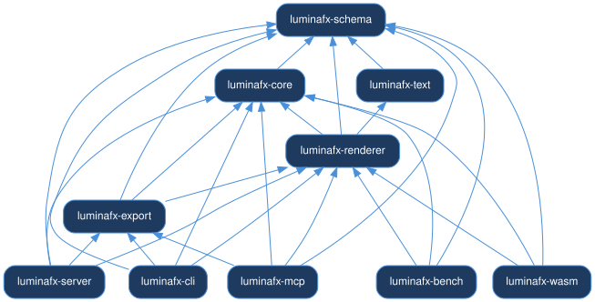
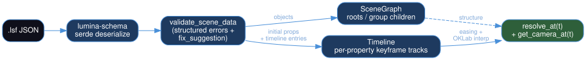
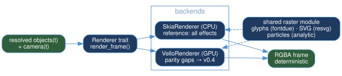
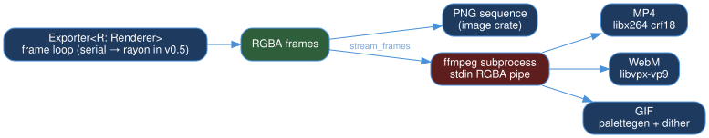
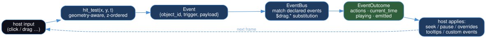

# Architecture

Lumina is a modular Rust workspace. Each crate has one job, and the renderer is
backend-agnostic behind a single trait. (Why it's shaped this way is a separate
document: [DESIGN.md](https://github.com/SakarZaidan/lumina/blob/main/DESIGN.md).)



*Generated from `cargo metadata` by `docs/architecture/gen-diagrams.sh` —
these are the real dependency edges, not an illustration.*

```
lumina/
├── crates/
│   ├── lumina-schema/    LSF types + JSON Schema generation (schemars)
│   ├── lumina-core/      Scene graph, timeline evaluator, easings, LAB interp, event bus
│   ├── lumina-renderer/  Renderer trait → SkiaRenderer (CPU) + VelloRenderer (GPU)
│   ├── lumina-text/      Fontdue TTF rasterization + per-character font fallback
│   ├── lumina-export/    PNG sequence + MP4/WebM/GIF (FFmpeg stdin pipe)
│   ├── lumina-mcp/    MCP server: the engine as tools for any agent, over stdio
│   ├── lumina-server/    Axum HTTP: /render /validate /patch /scene_patch /schema /objects
│   ├── lumina-wasm/      wasm-bindgen: render_frame, hit_test, process_event
│   └── lumina-bench/     Criterion benchmarks
├── sdks/{javascript,python}/
└── tools/lumina-cli/
```

## Data flow

```
LSF JSON
  → Schema validator (structured errors with fix_suggestion)
  → Scene graph + timeline (keyframe evaluation, easing, LAB color)
  → Renderer (Skia CPU  | Vello GPU)
  → Export (PNG sequence | FFmpeg → MP4)   or   WASM canvas
```







The event flow (host input → hit-test → event bus → playback outcome) is
diagrammed in [Events & Interactivity](./events.md#the-event-bus):



## The Renderer trait

A backend implements `render_frame`, `load_font`, and optionally `load_image` /
`set_time`. The `Exporter<R: Renderer>` and the WASM engine are generic over it,
so adding a backend never touches the scene/timeline code. `set_time` is what
lets time-dependent assets (animated GIFs) and the particle simulator pick the
right state per frame.

## Backend parity status

Skia (CPU) is the reference backend with full feature coverage. Vello
(GPU/wgpu, headless) reached object-type parity in v0.3.0 — text, LaTeX,
MathML, images, SVG and particles render on the GPU via a shared
rasterization module. Since v0.4, everything that *decides* what to draw —
parsing, geometry, ordering, transform math — lives once in the renderer's
`common/` module and is consumed by both backends, and parity is enforced
by a cross-backend pixel-diff suite
(`crates/lumina-renderer/tests/backend_parity.rs`) that renders every
fixture scene on both backends in CI:

| Feature | Skia (CPU) | Vello (GPU) |
|---|---|---|
| All 17 object types | ✅ | ✅ |
| Text / LaTeX / MathML / Image / SVG / Particles | ✅ | ✅ (shared rasterizer) |
| Linear & radial gradients (fill and stroke) | ✅ | ✅ (shared geometry) |
| Rounded rectangles (`rx`/`ry`) | ✅ | ✅ (shared geometry) |
| `draw_fraction` reveal | ✅ | ✅ (shared: a dash on lines, an arc-length trim on paths and curves) |
| Drop shadows / glow | ✅ | ✅ (shared blur pipeline) |
| Explicit `dash` arrays on Line | ✅ | ✅ (shared normaliser) |

Every feature row is exercised by the parity suite; scenes render the same
on either backend within the suite's tolerances. Text runs at the default
tolerance since both backends lay out glyphs through one path (TD-18); only the
combined showcase fixture, where text sits over gradients and curves, keeps a
slightly wider pixel budget.

## Key design choices

- **Declarative first** — scenes are data; nothing for an LLM to mis-sequence.
- **JSON to animate, types to render** — the timeline interpolates properties as
  JSON, so every field of every object animates with no per-property code, then
  resolves each object back to its typed props (`Timeline::resolve_at`) before a
  renderer sees it. A new `#[serde(default)]` field animates immediately. (The
  draw code is moving from string lookups onto those typed fields one object
  type at a time — RFC-0002 Stage 2 — which deletes the second copy of every
  default that the lookups carry.)
- **Deterministic** — identical inputs yield identical pixels (including particles).
